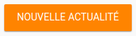
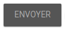
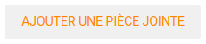
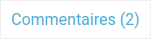
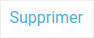
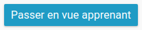
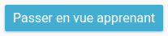

# Documentation CSS

## Les conventions à respecter :

### L'indentation :
L'indentation se fait avec une tabulation représentant 2 espaces.

### Le nommage de sélecteurs :
Le nom des class et des id se fait en anglais quoi qu'il arrive.
On exclue les majuscules des noms (souvent pris par le dev back, permet d'avoir une vraie différence visuelle entre l'un et l'autre).
Pour les mots composés, on utilisera le trait d'union pour séparer les deux mots :
```css
.my-profil {
}
```

#### La logique BEM :
On essaye de suivre au mieux le nommage [BEM](http://getbem.com/introduction/).

La convention de nommage suit ce modèle :

```css
.block{}
.block__element{}
.block--modifieur{}
```

- `.block` représente le niveau supérieur d'un composant.
- `.block__element` représente un descendant de `.block` puisqu'il contribue à former `.block` dans son ensemble.
- `.block--modifieur` représente un état ou une version différente de `.block`.

Exemple :
```css
.navigation {}
.navigation__right {}
.navigation--hover {}
```

#### Le OOCSS (Le CSS Orienté Objet) :
Le principe est simple : on essaye de segmenter au maximum nos propriétés CSS afin de pouvoir les réutilisé simplement d'un endroit à l'autre. Il permet de ne pas cloisonner les éléments pour pouvoir les réutiliser à notre guise.

Par exemple : Si vous devait faire un style pour une checkbox, plutôt que de l'appliquer en particulier à CE formulaire sur CETTE page, vous allez créer une class qui permet d'appliquer un style globale, que vous pourrez réutiliser sur n'importe quel page / élément.

Pour en savoir plus vous pouvez vous rendre sur [cette URL](https://www.design-fluide.com/21-09-2011/le-css-oriente-objet-explique-avec-monsieur-patate/).

### Les ancres JavaScript :
Pour les ancres javascript, préfixer la class par `"js-*"`.

Exemple :
```css
.js-toogle {}
```

### Le format :
- un seul sélecteur par ligne,
- un espace entre le sélecteur et l'accolade ouvrante,
- pas d'espace entre la propriété et les deux points,
- un espace entre les deux points et la valeur,
- pas d'espace entre la fin de la valeur et le point virgule,
- fermeture d'accolade sur une autre ligne,
- Saut de ligne entre chaque règle.

Exemple :
```css
.selecteur1,
.selecteur2,
.selecteur3 {
  propriete: valeur;
}
```

### Les commentaires :
D'une manière géréral, éviter les commentaires en fin de ligne. Si la ligne est trop longue, il y a une chance non nulle qu'il ne soit pas vu (en fonction de la taille de l'écran, le réglage de notre éditeur préféré, etc).

#### Les commentaires "contextuelles" :
Il arrive parfois qu'une partie du css est été pensé pour un style de balise. Par exemple, pour une class `link` on aurait tendance à noter :
```css
a.link {
  color: red;
}
```
Pour éviter de trop cloisonner le code, on va plutôt mettre en commentaire la/les balises les plus adapté pour cette class :

```css
/*a*/.link {
  color: red;
 }
 ```

 Ainsi, cela indique clairement quels sont les balises sur lesquelles théoriquement on devrait retrouver ce genre de class, sans pour autant anéantir toute chance de l'appliquer ailleurs.


### L'utilisation du !important :

Vous pouvez faire de la prévention en ajoutant `!important` dans le cas où vous savez que la règle sera **toujours** prioritaire, par exemple `.error {color: red !important;}`. `!important` devrait toujours être utilisé en tant que prévention et non en tant que hack.

**Utiliser `!important` pour sortir d'une situation périlleuse n'est pas conseillé**. Dans la mesure du possible, retravaillez votre CSS et essayez de lutter contre ces problèmes en faisant une refacto de vos sélecteurs.

## Styleguide : (Theme neo)

### Palette de couleurs :

Color | Name color | Hexadecimal
-------|--------|-------
 | `$cyan` | #4bafd5
 | `$green` | #46bfaf
 | `$yellow` | #ecbe30
 | `$orange` | #ff8500
 | `$red` | #e13a3a
 | `$pink` | #b930a2
 | `$purple` | #763294
 | `$indigo` | #1a22a2
 | `$white` | #ffffff
 | `$lightest-grey` | #f9f9f9
 | `$light-grey` | #f0f0f0
 | `$neutral-grey` | #dddddd
 | `$medium-grey` | #cccccc
 | `$solid-grey` | #aaaaaa
 | `$grey` | #555555
 | `$darkest-grey` | #333333
 | `$black` | #222222


### Les titres :

#### Titre h1 :


```css
h1 {
	font-family: 'Roboto';
  font-weight: 400;
  font-size: 34px;
  line-height: 30px;
  color: #4bafd5;
}
```
h2 : visuel
```css
h2 {
  font-family: 'Roboto';
  font-weight: 400;
  font-size: 20px;
  line-height: 30px;
  color: #4bafd5;
}
```
h3 : visuel
```css
h3 {
    font-size: 1.4em;
}
```

h4 : visuel
```css
h4 {
    font-size: 18px;
    color: $grey;
    font-weight: bold;
}
```
h5 :
h6 :

### La grille :

### Les breakpoints :

`$wide-screen: 1200px;` => Beginning wide desktop screen

`$tablette: 800px;` => Beginning landscape tablet and / or small desktop screen

`$small-tablette: 650px;` => Beginning large tablet portrait

`$fat-mobile: 550px;` => Beginning small tablet portrait

`$small-mobile: 420px;` => Beginning fat mobile portrait

### Les font-icons :

### Les formulaires et les messages d'erreur :

### Les liens et les boutons :

Button type | State : initial | State : hover | State : inactive
------------|-----------------|---------------|-----------------
Primary |  |  | 
Secondary |  |  | 
Tertiary |  |  | 
Quartenary |  |  | 
Other |  |  | 

## Les composants CSS :

#### Accordions :
`theme-open-ent/css/modules/_accordions.scss` :

```sass
.accordions {
	.accordion {
		h2 {
			background: $primary;
			border: none;
			font-size: 20px;
			color: $white;
			margin: 3px;
		}
		h2:hover {
			background: $primary-dark;
		}
		&:last-child {
			h2 {
				border: none;
			}
		}
		.toggle {
			border: 0;
			background: $background;
			.content {
				color: $grey;
				h3 {
					font-weight: normal;
					color: $accent;
					font-size: 16px;
				}
				select,
				input[type=text],
				textarea {
					background: $white;
				}
			}
		}
	}
	.accordion.opened {
		h2 {
			color: $white;
			background: $accent;
			border: none;
		}
		.toggle {
			border-top: 0;
			padding: 10px;
			overflow: auto;
			background: $white;
			border: none;
		}
	}
}
```

#### autocomplete
`entcore-css-lib/modules/_autocomplete.scss`

```css
.autocomplete.temp {
	div{
		font-style: normal;
		display: block;
		padding: 10px;
		border: 1px solid transparent;
		&:hover {
			border-top: 1px solid #ccc;
			border-bottom: 1px solid #ccc;
		}
		em.low-importance{
			border: none;
			font-style: italic;

			&:hover {
				background: transparent;
				border: none;
			}
		}
	}
	ul{
		list-style-type: none;
		margin: 0;
		padding: 5px;
		padding-left: 20px;
	}
}
```

#### dropDown :
`entcore-css-lib/modules/_drop-down.scss`

```css
	@include drop-down();
	overflow: hidden;
	height: auto;

	li {
		i.add-favorite {
			margin: 0 10px 0 0;
			&::before {
				color: $primary;
			}
		}
		&:hover {
			color: $white;
			background-color: $accent;
			a {
				color: $white;
			}
			i.add-favorite::before {
				color: $white;
			}
		}
	}
}
```
`theme-open-ent/css/modules/_drop-down.scss`

```css
.drop-down-block{
    i.arrow{
        color: $accent;
    }
    .drop-down-label, .drop-up-label{
        border-bottom: 1px solid $disabled-color;
        @include run-transition(all);
        & > label{
            font-weight: bold;
            color: $grey;
            @include run-transition(all);

            &:hover{
                color: $black;
            }
        }
        &:hover {
            border-bottom: 1px solid $accent;
        }

    }
    .drop-down-label{
        i.arrow{
            @include run-transition(all);
        }
        &+.drop-down-info{
            color: $disabled-color;
        }
    }
}
```

#### contactChip

#### infoTip
`entcore-css-lib/modules/_infotips.scss`

```css
infotip{
	position: relative;
	display: none;
	i.close{
		transition: color 250ms ease;
		cursor: pointer;
		position: absolute;
		top: 5px;
		right: 10px;
		&:hover{
			color: $accent;
		}
	}
}
```

#### lightbox
`theme-open-ent/css/modules/_lightbox.scss`

```css
.lightbox-window,
.lightbox .content {
    padding: 10px;
    box-shadow: 2px 2px 24px $shadow;
    background: $lightest-grey;
    h2,
    h2:first-child {
        font-size: 20px;
        font-weight: normal;
        margin-bottom: 10px;
    }
    nav.vertical {
        margin-right: 0;
        li {
            padding-left: 10px;
        }
        > ul > li,
        > div > ul > li {
            padding-left: 0;
        }
    }
    .tabs {
        margin-top: 10px;
        section {
            padding: 15px 0px;
            border: none;
            border-top: 1px solid $neutral-grey;
            background: $white;
        }
        header.selected {
            background: transparent;
        }
    }
}
```

#### multiComboboxes

#### searchUser

#### sharePanel

#### tooltip

---

_accordions.scss
_alphabetical.scss
_apps-view.scss
_articles.scss
_assistant.scss
_badges.scss
_bubble-container.scss
_buttons.scss
_buttons-set.scss
_cards.scss
_checkboxes-custom.scss
_chips.scss
_color-picker.scss
_dominos.scss
_dots-menu.scss
_dropdown-buttons.scss
_drop-down.scss
_embedder.scss
_explorer.scss
_flashmsg.scss
_forgot-panel.scss
_forms.scss
_help.scss
_icons-view.scss
_illustrated-links.scss
_illustrated-list.scss
_images.scss
_infotips.scss
_info-tuto.scss
_letter-picker.scss
_lightbox.scss
_lists.scss
_loading-list.scss
_loading-panel.scss
_mailbox.scss
_modules.scss
_multi-combo.scss
_navigations.scss
_notifications.scss
_panel.scss
_pills.scss
_pulsar.scss
_recipient-list.scss
_ribbon.scss
_schedule.scss
_select-blocks.scss
_select-list.scss
_side-panel.scss
_sniplets.scss
_sticky-row.scss
_tabs.scss
_timeline-story.scss
_toaster.scss
_toggle-panel.scss
_tooltips.scss
_widgets.scss
